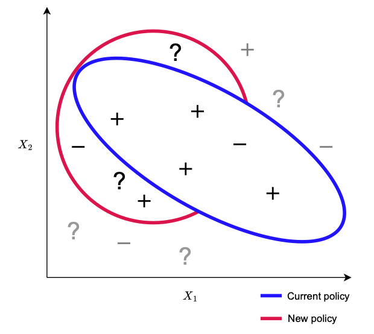
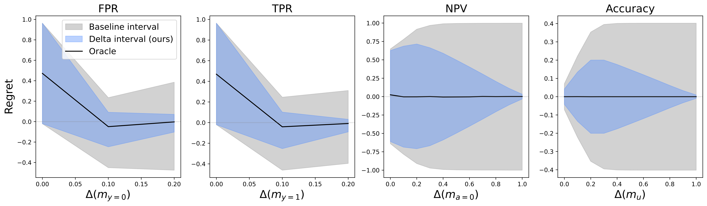

# Predictive Performance Comparison of Decision Policies Under Confounding


[__Predictive Performance Comparison of Decision Policies Under Confounding__](https://arxiv.org/abs/2404.00848)<br>

Luke Guerdan, Amanda Coston, Kenneth Holstein, Zhiwei Steven Wu<br>

Forty-first International Conference on Machine Learning (ICML 2024)

<div id="image-table">
    <table>
	    <tr>
    	    <td style="padding:10px">
        	    
      	    </td>
            <td style="padding:10px">
                Illustration of uncertainty in comparing two policies in a toy setting with $X \in \mathcal{R}^2$. Points are labelled by their outcome: positive (+), negative (-) or unknown (?). Ovals denote the selection region of a policy. Points that neither policy selects (denoted by grey) are irrelevant to the comparison. Our method leverages this to reduce policy comparison uncertainty.
            </td>
        </tr>
    </table>
</div>


## Setup

To install dependencies, run
```
! pip3 install -r requirements.txt
```

To replicate real world data experiments, download the [synthetic data file](https://gitlab.com/labsysmed/dissecting-bias/-/blob/master/data/data_new.csv?ref_type=heads) and copy it to `data/obermeyer.csv`.

## Experiments


Notebooks:
-  Numeric bound characterization: `regret_interval_characterization.ipynb`.
-  Synthetic experiments: `synthetic_experiments.ipynb`.
-  Real-world application: `realworld_experiments.ipynb`.

## Citation
```
@article{PC_Confounding_ICML_2024,
  title={Predictive Performance Comparison of Decision Policies Under Confounding},
  author={Guerdan, Luke and Coston, Amanda and Holstein, Kenneth and Wu, Zhiwei Steven},
  journal={ICML},
  year={2024}
}
```